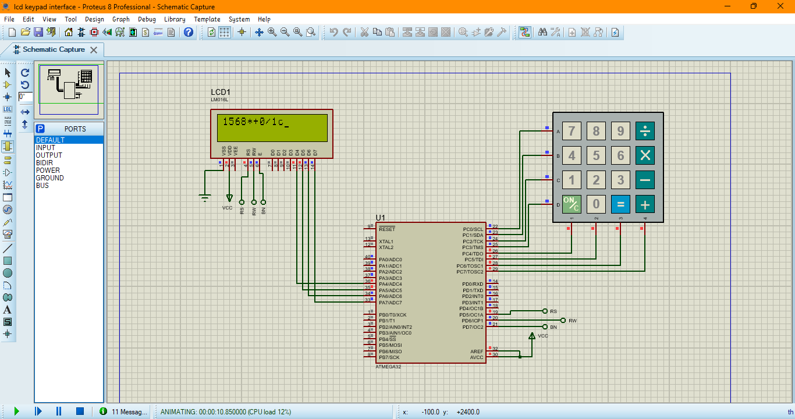

# LCD and Keypad Interfacing with ATmega32

  
*Figure: Complete project simulation in Proteus*

## Overview
This project demonstrates how to interface a **16x2 LCD** and an **alphanumeric keypad** with an **ATmega32 microcontroller** using **Proteus** for simulation and **Atmel Studio** for programming. The LCD displays keypresses detected from the keypad, providing a simple user interface for data entry.

## Features
- Displays keypresses from the alphanumeric keypad on the 16x2 LCD.
- Uses **ATmega32** microcontroller for processing.
- Simulated in **Proteus**.
- Programmed using **Atmel Studio**.
- Implements **polling-based keypad scanning**.

## Components Used
- **ATmega32 Microcontroller**
- **16x2 LCD Display**
- **4x4 Alphanumeric Keypad**
- **Pull-up Resistors (if required)**
- **Power Supply (5V)**
- **Proteus for Simulation**
- **Atmel Studio for Coding**

## Circuit Diagram
Include the Proteus circuit simulation screenshot here:


## Code Implementation
The microcontroller is programmed using **C** in **Atmel Studio**. Below is a snippet of the main code:

```c
#include <avr/io.h>
#include <util/delay.h>

void lcd_command(unsigned char cmd);
void lcd_data(unsigned char data);
void lcd_init();
char keypad_scan();

int main() {
    lcd_init();
    char key;
    while (1) {
        key = keypad_scan();
        if (key) {
            lcd_data(key);
        }
    }
}
```

## Simulation Setup
1. **Open Proteus** and place the required components: ATmega32, LCD, Keypad.
2. **Connect the components** as per the circuit diagram.
3. **Load the HEX file** generated from Atmel Studio into the microcontroller in Proteus.
4. **Run the simulation** and test the LCD display output.

## How to Use
1. **Clone the Repository**
   ```sh
   git clone https://github.com/sployal/Atmega32_lcd_interface
   ```
2. **Open Atmel Studio** and compile the provided code.
3. **Simulate the circuit in Proteus** using the generated HEX file.
4. **Press keys on the virtual keypad** and observe the LCD output.

## Expected Output
- The LCD should display the pressed key from the keypad.
- The system should handle multiple keypresses without glitches.

## Future Improvements
- Implementing **interrupt-based keypad scanning**.
- Adding **EEPROM storage for key inputs**.
- Enhancing LCD display features like scrolling text.

## Contributing
Contributions are welcome! Feel free to fork the repo, improve the project, and submit pull requests.

## License
This project is licensed under the **MIT License**.

---
Happy Coding! 🚀
